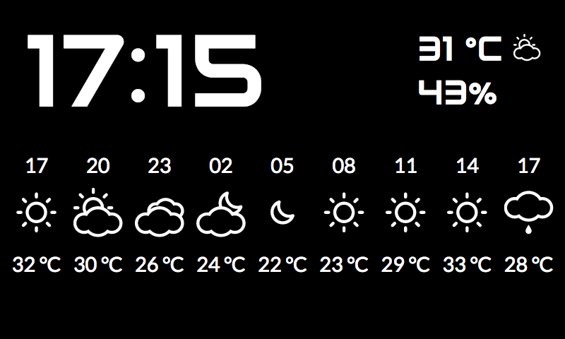

# WeatherClock
A simple clock with weather info, meant to be used on a Rasperry Pi with its 7" display, in a full-screen Chromium instance

# Clock setup

You'll need an API key for https://openweathermap.org in order to get the required information. Once you have it, edit **backend/config-dist.php** and save it as **backend/config.php**

# Chromium Setup

Follow the instructions at https://blogs.wcode.org/2013/09/howto-boot-your-raspberry-pi-into-a-fullscreen-browser-kiosk/ to setup your Pi to start Chromium on boot, pointing it to the website (hosted either on the Pi itself, or another machine)
